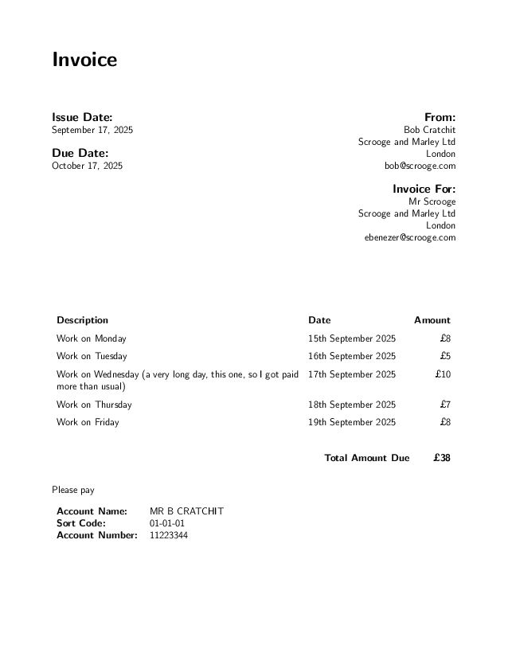

# invoice.sty

## Prerequisites
You need to have [LaTeX installed](https://www.latex-project.org/get/).

## Usage
In a latex document, include the package `invoice` and then create invoices using the command
```latex
\invoice{payee-address}{payer-address}{list of gigs}{bank details}
```

## Useful subcommands
### `\gig{Details}{Date}{Cost}`
An individual invoicable event. `Cost` should be a number only, no currency symbol.
`Details` and `Date` are plain text fields.


### `\bankdetailsuk{Account Name}{Sort Code}{Account Number}`
All fields are plain text.

## Example code
```latex
% example.tex
\documentclass[12pt]{letter}
\pagestyle{empty}
\renewcommand{\familydefault}{\sfdefault}
\usepackage[colorlinks,urlcolor=black]{hyperref}
\usepackage[margin=22mm]{geometry}
\usepackage{invoice}

\newcommand{\Me}{Bob Cratchit\\Scrooge and Marley Ltd\\London\\\email{bob@scrooge.com}}
\newcommand{\Boss}{Mr Scrooge\\Scrooge and Marley Ltd\\London\\\email{ebenezer@scrooge.com}}

\begin{document}
  \invoice{
    \Me
  }{
    \Boss
  }{
    \gig{Work on Monday}{15th September 2025}{8}%
    \gig{Work on Tuesday}{16th September 2025}{5}%
    \gig{Work on Wednesday}{17th September 2025}{10}%
    \gig{Work on Thursday}{18th September 2025}{7}%
    \gig{Work on Friday}{19th September 2025}{8}%
  }{
    \bankdetailsuk{MR B CRATCHIT}{01-01-01}{11223344}
  }
\end{document}
```

You should be able to create the example file by running:
```
pdflatex example.tex
```
and you should end up with something that looks like this:



## Next steps
- Allow decimals in costs
- Allow different currencies
- Allow tax calculations
- Allow different date formats
- Allow multiple pages in invoice table
- Allow for invoice dates other than the current day
- Allow for due dates other than one month from the current day


## Contact
Questions, suggestions and bug reports can be logged at https://github.com/ajasmith/invoices where you can also find the latest version.


_This file is auto-generated by `generatedoc.ps1`. Do not edit it directly._
